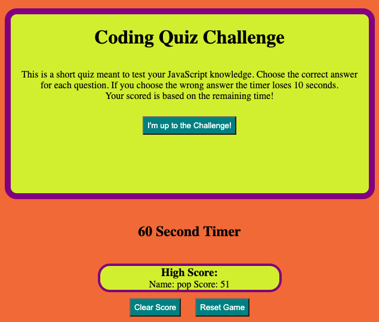
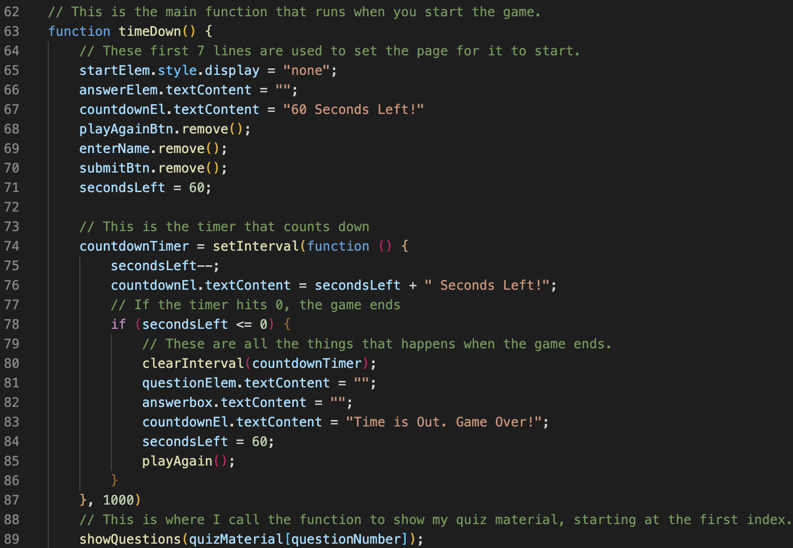
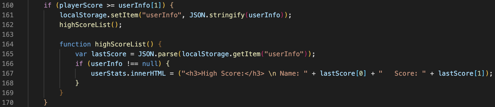

# Student-Quiz-Challenge

## Description

This is a simple quiz for students to test their knowledge. There is 8 multiple choice questions to test a student on their basic web development knowledge. I built this to help me learn how to use the interactive JavaScript Language as well as learn how to use Web API's. This is meant to help me learn DOM traverse, Local Storage, Add Event Listeners, and continue growing my understanding of functions.

Here is how the page looks when it is opened and ready to start the first game. 

In this challenge. A user presses the "I'm up to the Challenge!" button and is presented with 8 questions one at a time. If you answer correctly, then the next question appears. If the user selects the wrong answer, then 10 seconds are removed from the countdown timer. YES! There is a timer that is counting down from 60 to 0. If it reaches 0, then the user loses. If the user answers all the questions correctly, the remaining time is their score. The score is saved locally along with the Player ID if it is the new highest score. This should populate in the boxes below the game after they complete it the first time. It will update as the gets a better score. 

This screenshot shows the "main" function of the page. This is the function that runs once the "I'm up to the Challenge!" button is pressed. It updates the page to clear any buttons not needed and displays the questions plus answer choices. The function will also reset the variables needed for it to run smoothly. If the timer runs out, it will also end the game. 

The following image shows how localStorage works. If the users score is higher than the current highest score, it will store itself in localStorage. If the current score is lower than the highest score. It does not record it. 

## Usage

To play the game, the User clicks the "I'm up to the Challenge!" button. Once the button has been selected, then the first question will appear. If they answer correctly, then the next will populate, and so on. If they complete the game they are asked to enter their name and then their score will be shown.

You can view and play the game here:

https://tylerdins88.github.io/code-quiz/

## License

This is feature is a MIT License.

The following programming languages were used in teh creation of this game.

HTML CSS JavaScript & JavaScript Web API's